# Private AI Homelab Platform

This project is a production-style self-hosted infrastructure stack running on
an Apple Silicon Mac Mini with Docker Desktop, Tailscale, Traefik, Authentik,
AdGuard DNS, Open WebUI, n8n, monitoring, media automation, photo hosting, and
custom internal tooling. It also includes an on-demand IGA lab using midPoint to
simulate identity lifecycle, role governance, access review evidence, and
guarded provisioning into Authentik lab groups.

The design goal is simple: useful self-hosted services with no public internet
exposure, strong operational documentation, and an AI operator that can answer
live infrastructure questions from both runbooks and read-only system tools.

## Executive Summary

Highlights:

- Built a private Docker platform on macOS with Tailscale-only access.
- Designed a reverse-proxy and private DNS architecture using Traefik and
  AdGuard Home.
- Added centralized identity through Authentik forward-auth and OIDC.
- Built an Open WebUI "Homelab Operator" using local Ollama models, RAG over
  runbooks, and custom OpenAPI tools.
- Added an on-demand midPoint IGA lab for role catalog, joiner/mover/leaver,
  separation-of-duties, and access review demos.
- Built a guarded IGA-to-Authentik provisioning bridge for lab-only users and
  groups.
- Added live read-only AI tools for service inventory, Docker health, Uptime
  Kuma status, backup readiness, receipt analytics, and security posture.
- Documented the stack with operational runbooks, validation scripts, security
  notes, and repeatable service onboarding patterns.

## Architecture

<div class="mermaid">
flowchart TB
  user["Tailnet client<br/>Mac / iPhone / browser"]
  dns["AdGuard Home<br/>home.arpa DNS rewrites"]
  ts["Tailscale private network"]
  traefik["Traefik<br/>HTTPS reverse proxy<br/>tailnet-only :8443"]
  auth["Authentik<br/>SSO / forward-auth / OIDC"]

  subgraph docker["Docker Desktop on Apple Silicon Mac Mini"]
    homepage["Homepage"]
    wiki["Wiki.js"]
    immich["Immich"]
    openwebui["Open WebUI<br/>Homelab Operator"]
    n8n["n8n workflows"]
    uptime["Uptime Kuma"]
    dozzle["Dozzle"]
    dockge["Dockge"]
    media["Jellyfin / Seerr / Radarr / Sonarr / Prowlarr / qBittorrent"]
    tools["openwebui-tools<br/>read-only OpenAPI"]
    power["power-api<br/>constrained Docker control/status"]
    receipts["Receipts DB/API<br/>PostgreSQL + OCR workflow"]
    midpoint["midPoint IGA Lab<br/>on demand"]
    provisioner["IGA provisioner<br/>lab-* Authentik groups"]
  end

  user --> ts --> dns --> traefik
  traefik --> auth
  auth --> homepage
  auth --> wiki
  auth --> uptime
  auth --> dozzle
  auth --> dockge
  traefik --> immich
  immich -. OIDC .-> auth
  traefik --> openwebui
  traefik --> n8n
  traefik --> media
  auth --> midpoint
  midpoint --> provisioner --> auth

  openwebui --> tools
  tools --> power
  tools --> uptime
  tools --> receipts
</div>
<script type="module">
  import mermaid from "https://cdn.jsdelivr.net/npm/mermaid@10/dist/mermaid.esm.min.mjs";
  mermaid.initialize({ startOnLoad: true, theme: "dark" });
</script>

## Security Model

Core controls:

- No public ingress routes.
- Tailscale is the network boundary.
- AdGuard provides private `home.arpa` DNS.
- Traefik is the single HTTP/S ingress point.
- Authentik protects browser/admin applications.
- OIDC is used where app-native auth works better than forward-auth.
- Databases and internal APIs stay on private Docker networks.
- Open WebUI tools are read-only by default.
- Docker socket access is isolated behind constrained internal services.
- Real secrets stay in live `.env` files and are not committed.

## Access Model

| Layer | Purpose |
|---|---|
| Tailscale | Private network access only |
| AdGuard Home | Private DNS rewrites for `*.home.arpa` |
| Traefik | HTTPS routing and security middleware |
| Authentik forward-auth | Browser/admin SSO gate |
| App-native OIDC | Mobile/API-safe SSO for supported apps |
| App-local auth | Used where OIDC/forward-auth would break workflows |

## Service Inventory

| Area | Services |
|---|---|
| Ingress and DNS | Traefik, AdGuard Home, Tailscale |
| Identity | Authentik forward-auth, Authentik OIDC |
| Operations | Homepage, Dockge, Dozzle, Uptime Kuma, Wiki.js |
| AI | Open WebUI, Ollama, Homelab Operator, OpenAPI tools |
| Automation | n8n, receipt workflows, power-panel API |
| Productivity | Vikunja, Wiki.js |
| Photos | Immich with Authentik OIDC |
| Media | Jellyfin, Seerr, Radarr, Sonarr, Prowlarr, qBittorrent |
| Security | Trivy scripts, validation scripts, Nmap/ZAP workflow |
| Governance lab | midPoint IGA simulation, HR source, role catalog, access review evidence, guarded Authentik provisioning |
| Backup readiness | Restic scripts and readiness checks |

## AI Operator

Open WebUI is configured as a private operations assistant:

- Knowledge source: versioned runbooks under `docs/`.
- Embeddings: Ollama `nomic-embed-text`.
- Chat model: local Ollama model such as `gemma3:12b`.
- Tool interface: internal OpenAPI server on `internal-services`.

Current tool operations:

| Tool | Purpose |
|---|---|
| `service_inventory` | List homelab services, URLs, and auth model |
| `media_status` | Check whether the media stack is up |
| `docker_summary` | Summarize running, exited, and unhealthy containers |
| `security_posture` | Prioritize Docker and access-model findings |
| `receipt_summary` | Summarize receipt spending from PostgreSQL |
| `uptime_summary` | Read Uptime Kuma status from SQLite |
| `backup_readiness` | Report whether Restic backup setup is ready |

Example prompts:

```text
Use docker_summary and tell me which containers need attention.
```

```text
Use backup_readiness and tell me what is missing before backups are safe to run.
```

```text
Use security_posture with max_issues=8. Summarize the top findings by severity.
```

## Screenshots To Capture

Use these screenshots for a portfolio, README, or presentation. Keep sanitized
copies under `docs/assets/screenshots/`.

| Screenshot File | What It Shows |
|---|---|
| `homepage-dashboard.png` | Service organization and private app launchpad |
| `authentik-apps.png` | SSO and access-control layer |
| `uptime-kuma-status.png` | Monitoring coverage |
| `openwebui-operator.png` | AI assistant with runbooks and live tools |
| `openwebui-tool-call.png` | Live Docker/security/backup status from Open WebUI |
| `wikijs-runbooks.png` | Operational documentation layer |
| `traefik-dashboard.png` | Reverse proxy routing and middleware |
| `immich-oidc.png` | App-native OIDC pattern |
| `midpoint-users.png` | IGA demo users and lifecycle states |
| `midpoint-role-catalog.png` | Business role catalog for app access |
| `midpoint-access-review.png` | Access review evidence and SoD check |
| `authentik-lab-provisioning-users.png` | Dummy users provisioned into Authentik |
| `authentik-lab-provisioning-groups.png` | Lab-only Authentik groups created by the provisioner |
| `wikijs-iga-provisioning-runbook.png` | Finished provisioning runbook in Wiki.js |
| `wikijs-iga-report.png` | Executive-friendly IGA provisioning report |

Do not publish screenshots containing tokens, private emails, secret values, or
full internal logs.

## Screenshots

### Homepage Dashboard

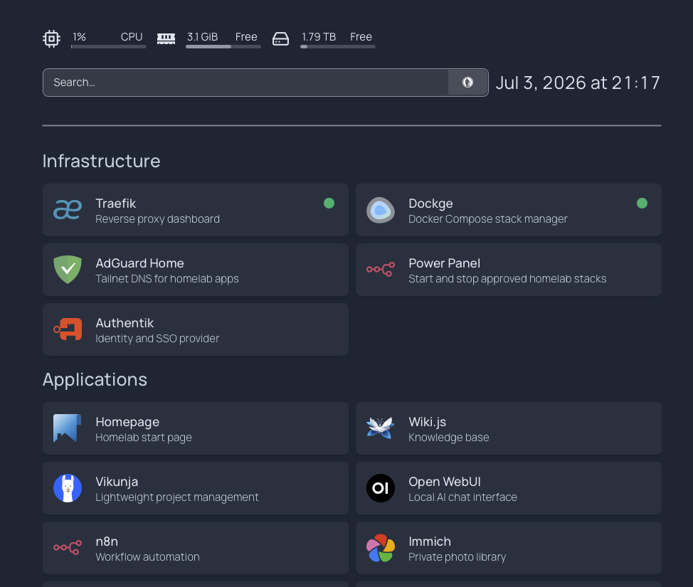

### Homelab Operator

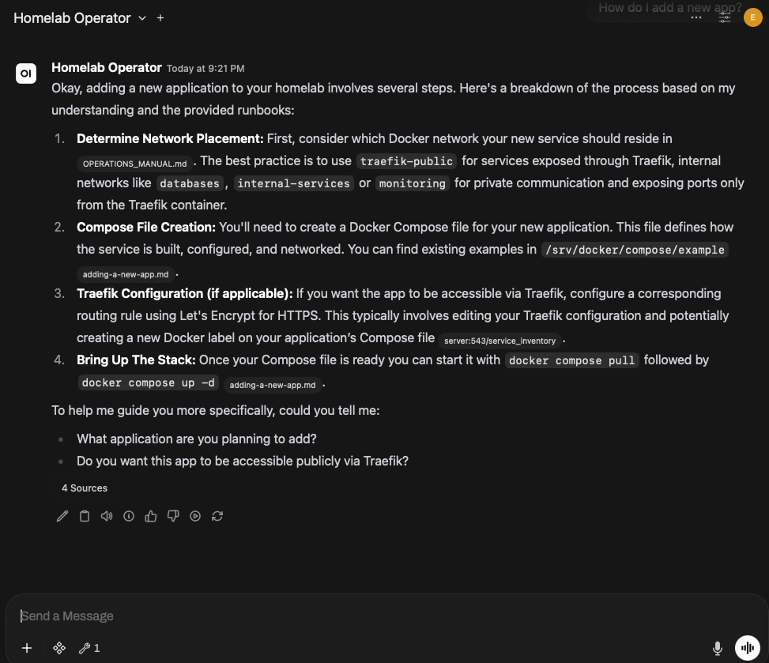

### Live Tool Call

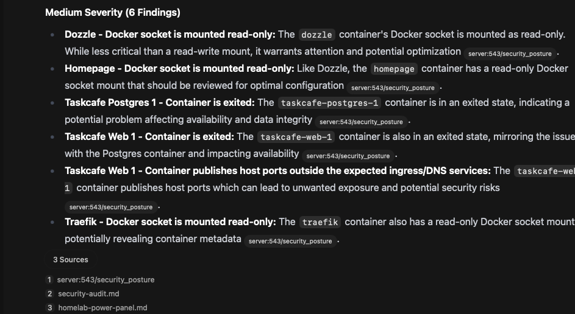

### Uptime Monitoring

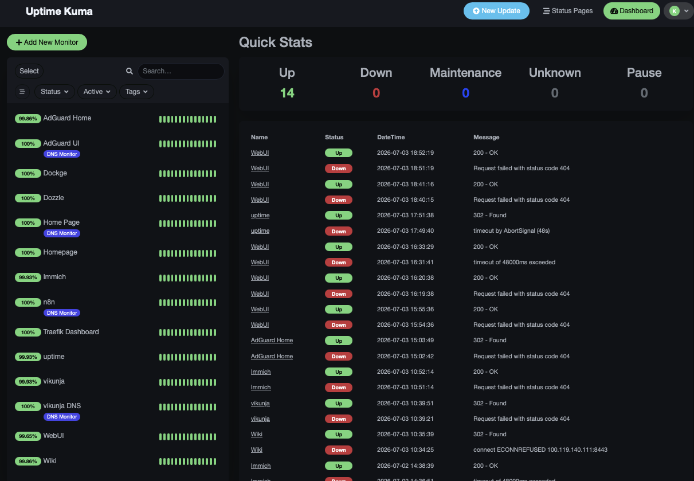

### Authentik Applications

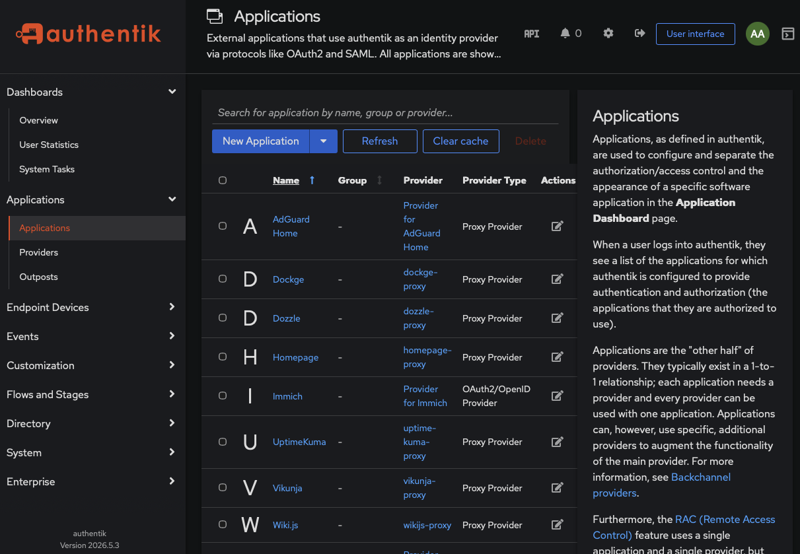

### Wiki Runbooks

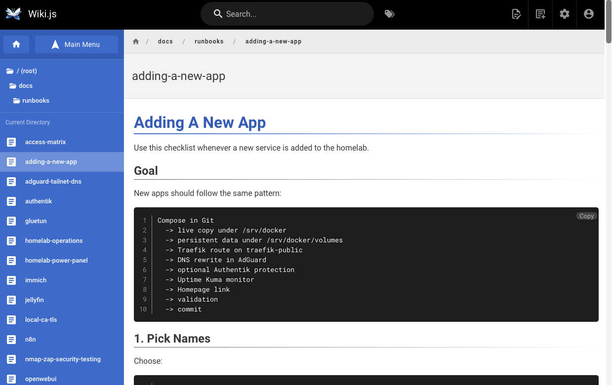

### Traefik Routing

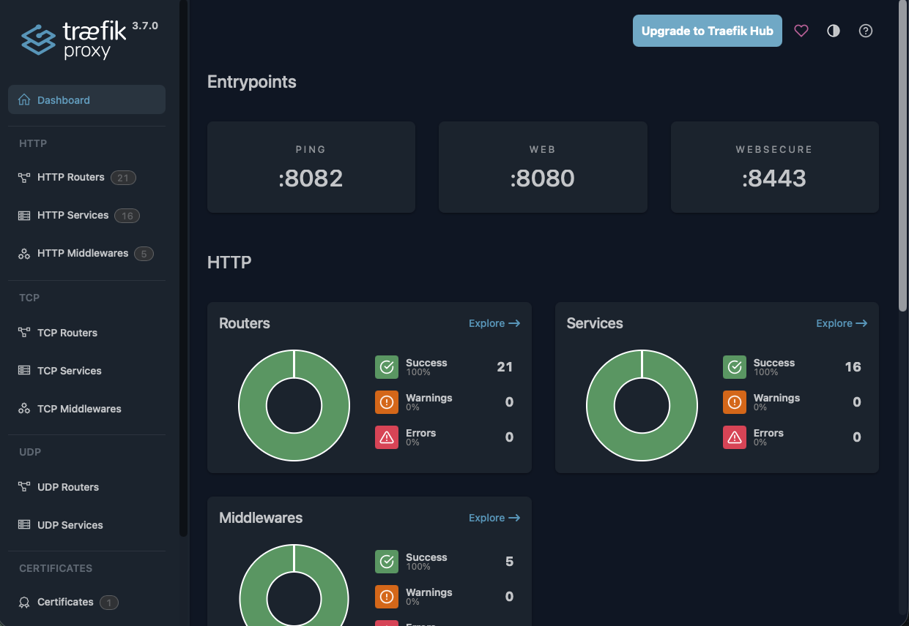

### Immich OIDC

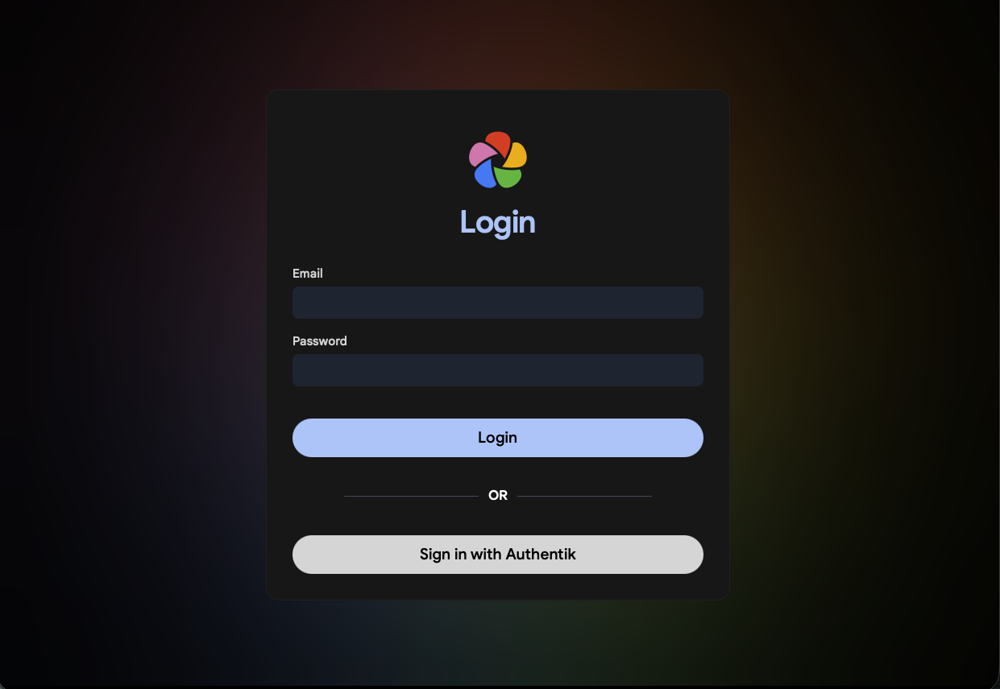

### midPoint IGA Users

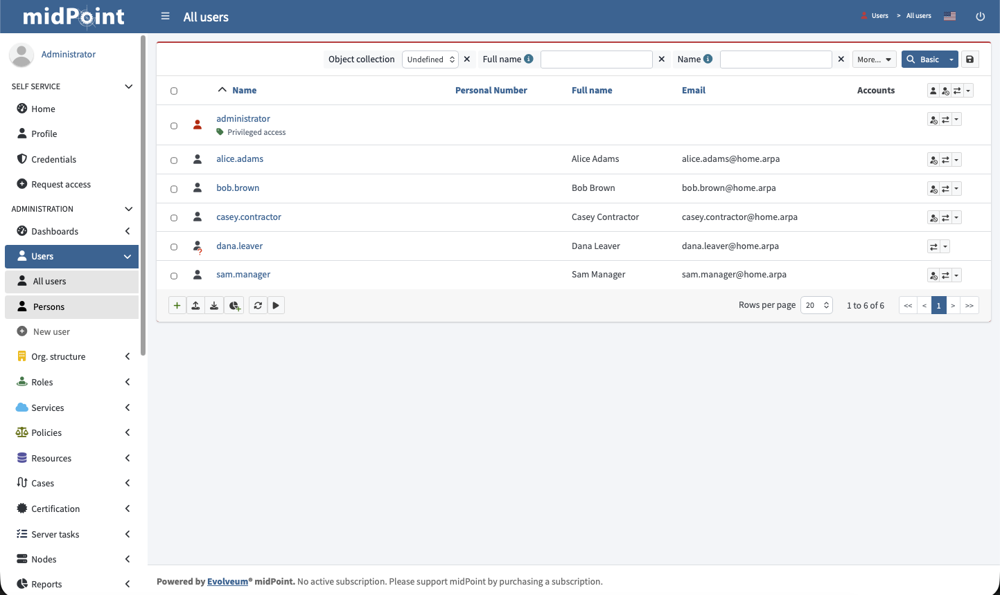

### midPoint Role Catalog

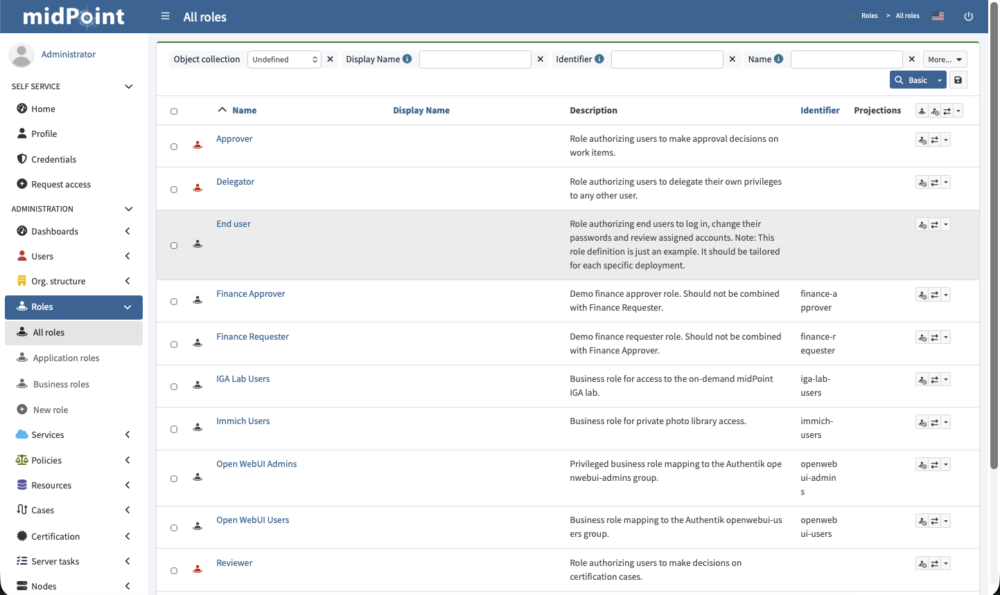

### Access Review Evidence

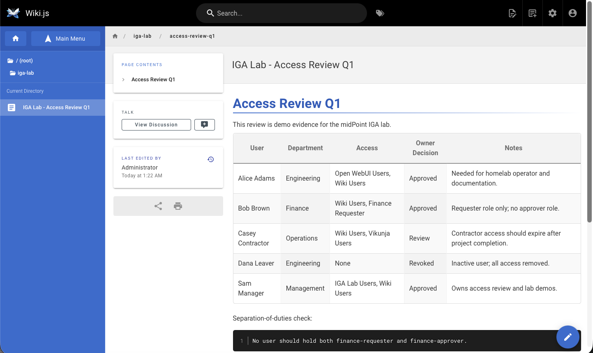

### Authentik Lab Users

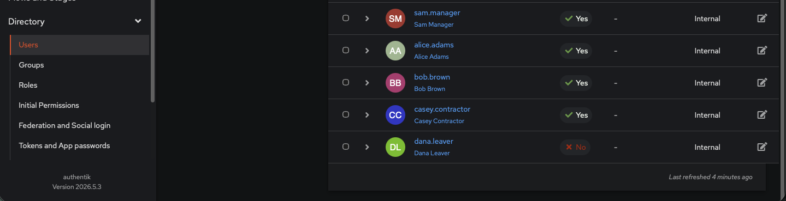

### Authentik Lab Groups

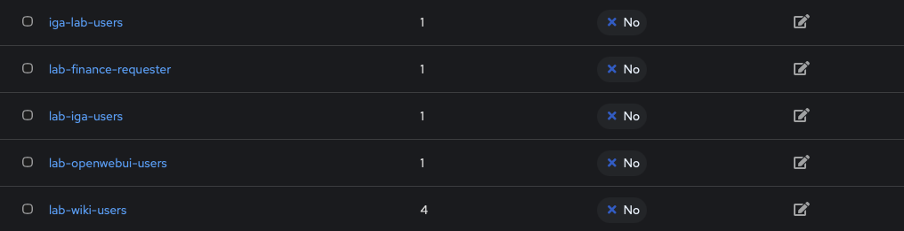

### IGA Provisioning Runbook

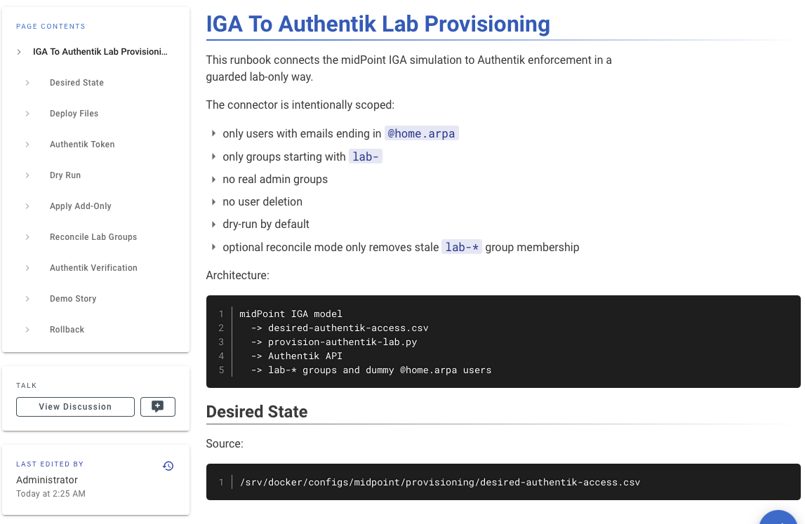

### IGA Provisioning Report

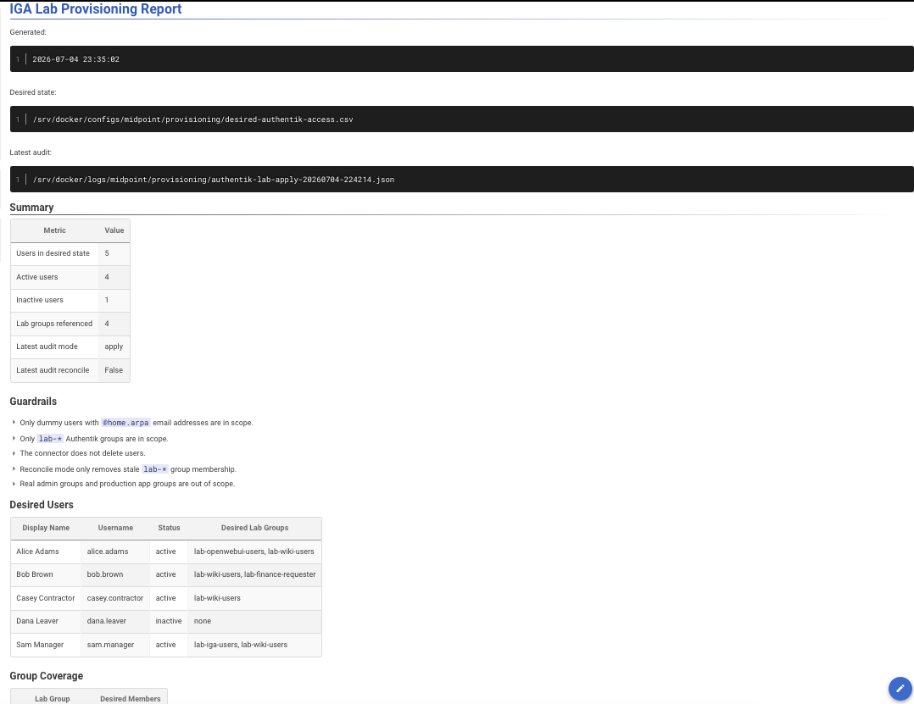

## Recruiter-Facing Highlights

- Designed and deployed a production-style private platform on Apple Silicon
  using Docker Desktop, Tailscale, Traefik, Authentik, and AdGuard DNS.
- Built a zero-public-exposure service architecture with private DNS, tailnet
  routing, internal TLS, and layered authentication.
- Implemented centralized identity with Authentik forward-auth and OIDC while
  preserving app/mobile workflows where proxy auth would break APIs.
- Created an AI-powered operations assistant using Open WebUI, local Ollama
  models, RAG over runbooks, and custom OpenAPI tools.
- Built custom internal APIs for service inventory, Docker health, Uptime Kuma
  status, backup readiness, receipt analytics, and security posture.
- Applied least-privilege patterns by keeping Open WebUI tools read-only and
  isolating Docker socket access behind constrained internal services.
- Built operational runbooks for DNS, TLS, SSO, backups, validation, security
  testing, service onboarding, power cycling, and updates.
- Added monitoring and validation through Uptime Kuma, Dozzle, Trivy scripts,
  Nmap/ZAP workflows, and custom validation scripts.
- Built a private receipt-processing workflow using n8n, OCR/vision extraction,
  PostgreSQL, review dashboards, and spending analytics.
- Built an on-demand IGA simulation with midPoint, modeling HR-driven users,
  business roles, joiner/mover/leaver lifecycle, separation-of-duties checks,
  and access review evidence.
- Implemented guarded IGA-to-Authentik provisioning with dry-run mode, audit
  logs, `@home.arpa` dummy-user restrictions, and `lab-*` group scope controls.
- Practiced infrastructure-as-code discipline with Git-tracked Compose files,
  `.env.example` templates, secret hygiene, and repeatable deployment patterns.

## What This Demonstrates

Engineering skills demonstrated:

- Systems architecture
- Docker Compose operations
- Reverse proxy design
- Identity and access management
- Private networking
- Secure service exposure
- Operational automation
- Monitoring and validation
- AI tool integration
- Identity governance simulation
- Documentation and runbook design
- Risk assessment and exception tracking

## Current Known Gaps

- Restic backup repository is intentionally parked until the external SSD is
  connected and configured.
- Some admin services require Docker socket access by design.
- The IGA provisioning bridge is intentionally scoped to lab-only users and
  `lab-*` groups; production-style approvals/connectors would be a future
  expansion.
- Old Taskcafe containers are visible as drift and should be cleaned up or
  documented.

See:

- [Portfolio Demo Script](portfolio-demo-script.md)
- [Security Exceptions Register](security-exceptions-register.md)
- [Operations Manual](OPERATIONS_MANUAL.md)
- [Open WebUI Runbook](runbooks/openwebui.md)
- [Access Matrix](runbooks/access-matrix.md)

